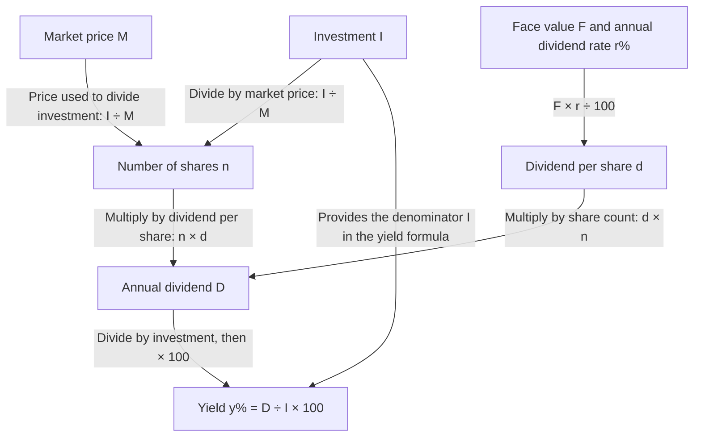

# A share has a price and a printed value

A company divides ownership into shares. A person owning them is a shareholder. For this chapter, distinguish **what is printed on a share** from **what a buyer pays for it**.

Consider a share with **face value ₹100**, available for **₹120**, with a declared **8% annual dividend**. Owning ten such shares will be our running example.

## Concept checklist

| Concept | Meaning in this chapter | In the running example | Do not confuse it with |
|---|---|---|---|
| Share | One unit of ownership | One ₹100-face-value share | ₹100 cash paid today |
| Shareholder | Person owning shares | The person owning ten shares | The company itself |
| Face / nominal / par value F | Reference value used for declared dividend | ₹100 per share | Current buying price |
| Market value M | Price of one share in the transaction | ₹120 per share | Face value |
| At par | M equals F | Would mean price ₹100 | Merely knowing face value |
| Premium | Market price exceeds face value | ₹20 above ₹100; equivalently 20% here | Dividend or capital gain |
| Discount | Market price is below face value | A price of ₹90 would mean ₹10 discount | A loss already realised by this buyer |
| Investment I | Total money paid to buy the holding | 10 × ₹120 = ₹1,200 | Total face value ₹1,000 |
| Number of shares n | Count of units owned | 10 shares | A rupee amount |
| Dividend rate r% | Declared income as a percentage of face value | 8% of ₹100 | 8% of ₹120 |
| Dividend income D | Rupee income from the holding | ₹8 per share; ₹80 for ten | The 8% rate itself |
| Yield / return y% | Annual dividend as a percentage of money invested | 80/1200 × 100 = 6⅔% | The company’s 8% dividend rate |
| Sale proceeds S | Cash received when shares are sold | At ₹130 each, ten yield ₹1,300 | The gain alone |
| Capital gain / loss | Sale proceeds minus purchase cost of sold shares | ₹1,300 − ₹1,200 = ₹100 gain | Annual dividend |

Dividends are not guaranteed in real life. These questions give a declared rate and ask you to calculate using it. No prediction of future market prices is needed.

## Why do we use two different values?

The declared rate tells us how much dividend the company pays **per share**, using face value. The buying price tells us how much **this investor spends** to own that share.

Two investors can buy identical ₹100 shares at ₹80 and ₹120. If the company declares 8%, each earns **₹8 per share**. Their yields differ:

- ₹8 income on ₹80 spent: **10%**.
- ₹8 income on ₹120 spent: **6⅔%**.

The cheaper buyer earns more dividend per rupee invested, although the company pays exactly the same dividend per share.

**How to read the arrows:** each label states how the starting quantity is used to calculate the next one. Two arrows entering the same box supply inputs to **one calculation**, not two separate answers. For example, investment and market price give n = I ÷ M; share count and dividend per share give D = n × d. Here r is the numerical percentage: for 8%, use r = 8.

Read the two paths separately: **market price controls how many shares money buys; face value controls what each share earns**. They meet at annual dividend. To find yield, compare that income with the money spent.

## Four language distinctions to say aloud

1. **“₹50 shares”** states face value. **“Shares at ₹60”** states market value.
2. **“12% dividend”** is the company’s rate on face value. **“12% return on investment”** is the buyer’s yield on cost.
3. **“Dividend on one share”** is d. **“Total annual dividend”** is D = n times d.
4. **“Sell for ₹8,400”** means proceeds. **“Make a gain of ₹8,400”** means sale proceeds minus relevant cost.

## Understand before calculating

Try to explain these without writing a formula:

- If market price rises but the declared dividend is unchanged, does each share earn more dividend? **No.** Its face value and declared rate determine that dividend.
- Does a higher buying price increase yield? **No**, for the same per-share dividend; the same income is compared with a greater cost.
- Does equal investment in two companies imply equal share counts? **No**, unless market prices are equal.
- Does owning more shares necessarily give greater income than another holding? **No**; dividend per share may be lower.
- Can you find capital gain from a sale without knowing the cost of the sold shares? **Not uniquely.** Sale proceeds alone are insufficient.

Next: [Formulae: derive, select and check](./formulae.md). Return here whenever a calculation uses the wrong base.
