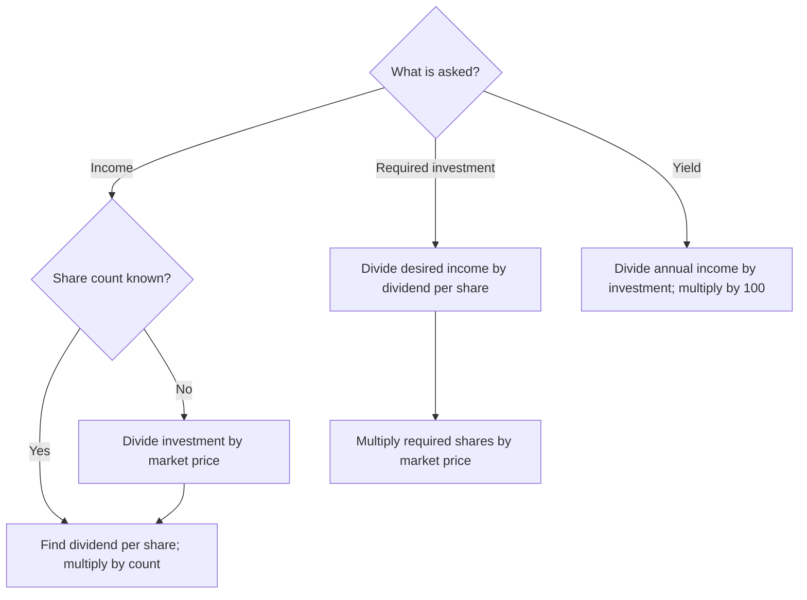

# Read for meaning before hunting for a formula

A long question is a short set of relationships written as a story. Your first job is to uncover those relationships. Do not start multiplying the first two numbers you see.

## A repeatable reading routine

1. **Read the whole question once.** What is happening: buying, receiving dividend, selling, reinvesting or dividing money?
2. **Read the final request again.** Circle the unknown and its unit: shares, rupees, percentage, or increase/decrease.
3. **Label each given value.** Put F beside face value, M beside market price, r beside company dividend rate, and I beside total money invested. Use a separate row for each company or transaction stage.
4. **Underline words that change the method.** Premium/discount, rupees/percent, annual/half-yearly, by/to, equally, difference, remaining, including dividend.
5. **Translate the quotation into M.** Do this before calculating share count or investment.
6. **Plan the missing bridge.** To get income from invested money, you need share count and dividend per share. To get investment from desired income, work backwards through the share count.
7. **Write the formula or equation, then substitute.** Show one meaningful transformation per line.
8. **Check the answer against the story.** Is the unit right? Is a decrease labelled? Does substituting back satisfy the stated income?

## Read this source question together: A10, p. 28

> ₹7,500 invested in 10% ₹100 shares gives annual income ₹500. Find the price paid for each share.

| Phrase | What it tells us | What it does NOT tell us |
|---|---|---|
| ₹7,500 invested | I = ₹7,500, total purchase cost | The price of one share |
| 10% | Dividend rate r = 10 | Investor yield |
| ₹100 shares | F = ₹100 per share | M = ₹100 |
| Annual income ₹500 | D = ₹500 per year | Capital gain |
| Price paid for each | Find M in ₹ per share | Total investment, already given |

**Plan before solving:** the total income tells us how many shares are producing income. Once we know the count, divide the total buying cost by that count.

Dividend per share = 10% of ₹100 = ₹10. Number of shares = 500/10 = 50. Price paid per share = 7500/50 = **₹150**.

**Why not 10% of ₹7,500?** The 10% refers to face value, not purchase cost. That shortcut would calculate the wrong quantity and never find the asked price.

## Choose the next step from the unknown

This diagram covers the basic buying/income family. It is not a substitute for the separate transaction or allocation models below.

## Words that create different problems

| Wording | Translate it as | Typical mistake |
|---|---|---|
| Increase income **by** ₹150 | Additional income = ₹150 | Subtract current income from ₹150 |
| Increase income **to** ₹600 | Additional income = 600 − current income | Treat ₹600 as entirely additional |
| Invest **equally** in A and B | Same capital x in each | Same number of shares |
| Receive **equal dividends** | Income A = income B | Same dividend rates |
| **Combined** annual income | Add the two income expressions | Equate the incomes |
| **Difference** in income | Subtract the smaller from the larger | Add yields |
| Reinvest **proceeds** | Reinvest sale cash | Automatically include old dividend |
| Reinvest proceeds **including dividend** | Add the specified dividend to sale cash | Omit the dividend |
| Sell **80%** | Retain 20% | Calculate future income on all shares |
| Shares **worth** an amount | Identify whether value is nominal or market | Quietly assume a meaning |

## Read a transaction in time order

For “buy → earn dividend → sell → reinvest,” make a table **before calculating**:

| Stage | Company | Face value | Market price used | Share count | Income or cash |
|---|---|---|---|---|---|
| Original purchase | A | FA | Buying price | nA | Original investment |
| Dividend | A | FA | Not needed for per-share dividend | Eligible A holding | Dold |
| Sale | A | Not the sale-price base | Selling price | Number sold | Sale proceeds |
| New purchase | B | FB | New buying price | nB | Reinvested cash |
| New dividend | B | FB | Not needed for per-share dividend | New B holding | Dnew |

Shares do not transfer unchanged between companies: **cash transfers**. That is why 60 old shares can become 140 new shares.

## Read an algebra problem backwards from the condition

“Two equal investments give ₹936 combined income” tells you what to equate to ₹936. Let x mean **investment in each company**. Convert x into shares and then income in each company; add those expressions.

“Divide ₹50,760 into two parts with equal incomes” is different. Let x be one part and **50760 − x** the other. Equate incomes, not investments.

If a question asks overall yield first and an unknown investment second, you may need to **calculate the investment first**. Logical dependency matters more than the order of the printed subparts. Present the answers with the correct labels afterwards.

## Exam presentation: what should appear on the page?

Use this structure, adapted to the problem:

1. **Given / interpretation:** name the face value, market value, rate and relevant holding.
2. **Formula / equation:** show the mathematical relationship before or alongside substitution.
3. **Substitution and calculation:** keep enough intermediate steps to expose your method.
4. **Conclusion:** answer the requested quantity, with ₹, shares or %, and increase/decrease where applicable.
5. **Quick check:** test the result mentally or by substitution; include it when it helps justify a comparison or ambiguous interpretation.

Do not copy every teaching explanation into the exam. Learn the reasoning fully, then write the essential mathematical steps. No official mark allocation is being claimed here.

## Before attempting Core

Take any three questions and write only **given → wanted → plan**, without arithmetic. If you cannot select the next step, revisit the relevant concept rather than doing more numerical repetitions.

Then use [worked solutions](./worked-solutions.md): read the reasoning, cover the solution, reproduce the exam steps, and attempt the linked transfer question.
