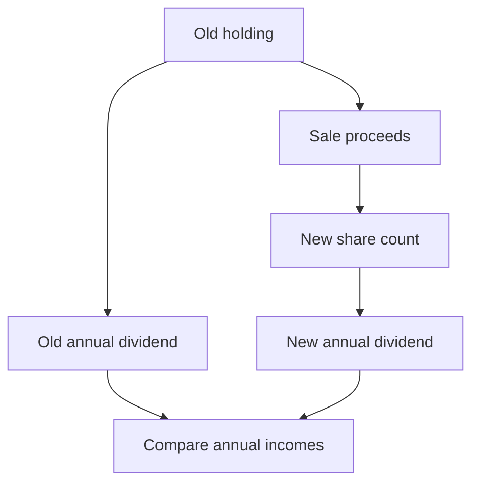

# Learn the thinking, then write the mathematics

Each example separates **reading**, **planning**, **exam working**, and **checking**. Read the explanation slowly the first time. Then cover it and reproduce the mathematical solution yourself. Finally attempt the transfer question without looking at its answer.

Source IDs refer to the [complete practice bank](./strengthen.md); printed-page references are retained there. E1–E15 are expanded presentations of existing source questions, not new textbook questions. They do not change the 76-question coverage count or the 29-question Core selection.

## E1. Decode the price before finding cost

**Source W01(i), p. 25:** Find the money needed to buy 350 ₹20 shares at a premium of ₹7.

**Read:** 350 is the count; ₹20 is face value; ₹7 is an amount added to face value. The question asks total investment, not dividend. There is no dividend rate to use.

**Plan:** first find the price of one share, then multiply by 350.

**Exam working**

Market value of one share = face value + premium

= ₹20 + ₹7 = **₹27**.

Investment = number of shares × market value

= 350 × ₹27 = **₹9,450**.

**Check:** A premium makes the market price greater than ₹20, so the total must exceed 350 × ₹20 = ₹7,000. ₹9,450 does.

**What changes in a variation?** At a **7%** premium, the premium would be 7% of ₹20 = ₹1.40, not ₹7. At a discount, subtract instead. At a quoted market price, no addition is needed.

**Try next:** P01, all six parts. Explain the price interpretation before each calculation.

## E2. Investment to shares to annual income

**Source W02, p. 25:** ₹12,500 is invested in ₹50 shares bought at ₹62.50 each. Dividend is 6%. Find annual income.

**Read:** I = ₹12,500; F = ₹50; M = ₹62.50; r = 6. The unknown is D, a rupee income per year.

**Plan:** money spent does not directly tell us income. Find how many shares were bought and what each earns. Multiply those two results.

**Exam working**

$$n=\frac{I}{M}=\frac{12500}{62.50}=200\text{ shares}.$$

$$d=\frac{6}{100}\times₹50=₹3.$$

$$D=nd=200\times₹3=\boxed{₹600\text{ per year}}.$$

**Why these bases?** ₹62.50 tells us the price of one share, so it belongs in the buying division. The company’s 6% is declared on ₹50 face value, so ₹50 belongs in the dividend multiplication.

**Check:** 200 × ₹62.50 = ₹12,500. The total nominal value is 200 × ₹50 = ₹10,000, and 6% of that is ₹600. Do not take 6% of the market investment.

**Try next:** A05(i), then A09. The latter also requires interpreting percentage premium.

## E3. Find the company’s dividend rate

**Source A08, p. 28:** ₹8,800 is invested in ₹100 shares at 10% premium. Annual dividend is ₹1,200. Find the share count and dividend rate.

**Read:** The 10% describes **premium**, not dividend. Dividend rate is the unknown. Keep those two percentages separate.

**Plan:** decode M; use investment to find n; compare dividend with the holding’s total face value nF.

**Exam working**

Premium per share = 10/100 × ₹100 = ₹10.

M = ₹100 + ₹10 = ₹110.

$$n=\frac{8800}{110}=80\text{ shares}.$$

Total face value = 80 × ₹100 = ₹8,000.

$$r=\frac{D}{nF}\times100=\frac{1200}{8000}\times100=\boxed{15\%}.$$

**Check:** 15% of ₹100 = ₹15 per share; 80 × ₹15 = ₹1,200. Dividing ₹1,200 by ₹8,800 instead would find yield, a different percentage.

**Try next:** A01e. Explain why at par makes investment and total face value equal in that question.

## E4. Desired income to required investment

**Source T04, p. 35:** 15% ₹100 shares are at 20% premium. Find income per share, shares needed for ₹6,480 annual income, and investment.

**Read:** 15% is the dividend rate; 20% changes the buying price. ₹6,480 is the target annual income, not money available to invest.

**Plan:** the desired income must be built from identical per-share dividends. Find that count first, then price it.

**Exam working**

(i) Dividend per share:

$$d=\frac{15}{100}\times₹100=\boxed{₹15}.$$

(ii) Required shares:

$$n=\frac{D}{d}=\frac{6480}{15}=\boxed{432\text{ shares}}.$$

(iii) Market price = ₹100 + 20% of ₹100 = ₹120.

$$I=nM=432\times₹120=\boxed{₹51,840}.$$

**Check:** 432 × ₹15 = ₹6,480. Dividing ₹6,480 by ₹120 would count how many shares ₹6,480 could buy; it would not answer the desired-income question.

**Try next:** B06. Use the same chain with a non-integer dividend per share.

## E5. Yield and its reverse calculations

**Source W09, p. 29:** 9% ₹100 shares yield 7.5%. Find market price and the investment needed for ₹630 annual dividend.

**Read:** The company pays 9% of F, while the investor earns 7.5% of M. Both descriptions refer to the **same dividend per share**.

**Plan:** set 7.5% of the unknown price equal to the ₹9 per-share dividend. Then solve the required-income chain from E4.

**Exam working**

Dividend per share = 9/100 × ₹100 = ₹9.

Let market price be ₹M. Since yield is 7.5%:

$$\frac{7.5}{100}M=9.$$

Multiplying both sides by 100/7.5:

$$M=\frac{900}{7.5}=\boxed{₹120}.$$

For ₹630 income, n = 630/9 = 70 shares.

Required investment = 70 × ₹120 = **₹8,400**.

**Check:** ₹9 is 7.5% of ₹120. Because yield is below the company’s dividend rate, market price should be above face value. It is.

**Different unknown — B03:** If F = ₹100, M = ₹120 and yield is 15%, income per share is 15% of ₹120 = ₹18. Therefore the company’s dividend rate is 18/100 × 100 = **18%**. Do not return the already-given 15% yield.

**Try next:** B08(iii), B03 and A10. A10 gives total income and investment instead of yield; recover share count before price.

## E6. Additional income means additional shares

**Source T05, p. 35:** 496 ₹100 shares were bought at ₹132 each, paying 7.5%. Find investment, current income and extra investment for ₹7,200 more annual income.

**Read:** “Increase by ₹7,200” is additional income. It is not the desired final total. The price remains ₹132 for the extra purchase under the question’s assumption.

**Exam working**

(i) Original investment = 496 × ₹132 = **₹65,472**.

(ii) Dividend per share = 7.5/100 × ₹100 = ₹7.50.

Current annual income = 496 × ₹7.50 = **₹3,720**.

(iii) Additional shares = additional income / dividend per share

= 7200/7.5 = 960 shares.

Extra investment = 960 × ₹132 = **₹1,26,720**.

**Check:** 960 new shares contribute exactly 960 × ₹7.50 = ₹7,200 more income. Final income would be ₹3,720 + ₹7,200 = ₹10,920. The question asks extra investment, not the total invested after buying more shares.

**Try next:** T14, which asks for the extra count rather than the extra money.

## E7. Compare investments fairly

**Source B13, p. 34:** Compare 5% ₹100 shares at ₹120 with 6% ₹100 shares at ₹132. Then find the annual income difference on ₹26,400 invested in each.

**Read:** Dividend rates differ and prices differ. Compare what the same rupee investment earns. A higher declared rate alone is insufficient.

**Exam working**

First company: dividend per share = ₹5; yield = 5/120 × 100 = 25/6% ≈ 4.1667%.

Second company: dividend per share = ₹6; yield = 6/132 × 100 = 50/11% ≈ 4.5455%.

Therefore the **second company gives the higher dividend yield**.

For ₹26,400 in the first: shares = 26400/120 = 220; income = 220 × ₹5 = ₹1,100.

For ₹26,400 in the second: shares = 26400/132 = 200; income = 200 × ₹6 = ₹1,200.

Difference = ₹1,200 − ₹1,100 = **₹100 per year**, in favour of the second.

**Check:** Higher yield on equal capital should give greater income. Both parts agree. For exact comparisons, retain fractions until the conclusion rather than rounding early.

**Try next:** B12, where the lower declared dividend rate wins. Then attempt CASE using a separate F/M/r row for each company.

## E8. Partial sales: cost, proceeds and what remains

**Source W05, pp. 26–27:** ₹9,000 buys 6% ₹100 shares at ₹150. Find income; then find capital gain from selling half at ₹200.

**Plan:** establish the original holding. A gain calculation compares sale cash with the original cost of **only the shares sold**.

**Exam working**

Original shares = 9000/150 = 60.

Dividend per share = 6% of ₹100 = ₹6; original annual income = 60 × ₹6 = **₹360**.

Shares sold = half of 60 = 30.

Sale proceeds = 30 × ₹200 = ₹6,000.

Original cost of those shares = 30 × ₹150 = ₹4,500.

Capital gain = ₹6,000 − ₹4,500 = **₹1,500**.

**Check:** Per-share gain is ₹50, so 30 × ₹50 also gives ₹1,500. Subtracting the whole ₹9,000 purchase cost would incorrectly treat the retained 30 shares as having disappeared.

**Cash-target variation — T09:** ₹45,000 buys 360 shares at ₹125. To raise ₹8,400 by selling at ₹140, sell 8400/140 = 60 shares. Thus 360 − 60 = 300 remain. At ₹15 dividend each, future annual income on the remainder is **₹4,500**. The cash target specifies proceeds, not profit.

**Fraction variation — T16:** Selling 80% leaves 20%; first calculate the original count, then the retained count, then its dividend.

**Total-profit variation — T13:** ₹52,000 buys ₹100 shares at ₹20 discount, so price is ₹80 and count = 52000/80 = 650. The 8% dividend gives ₹8 per share; annual dividend = 650 × ₹8 = ₹5,200. Sell at ₹20 premium, so sale price is ₹120 and proceeds = 650 × ₹120 = ₹78,000. Capital gain = ₹78,000 − ₹52,000 = ₹26,000. Profit **including dividend** = ₹26,000 + ₹5,200 = **₹31,200**. Check independently: 650 × (120 − 80 + 8) = ₹31,200. Add dividend only because the question explicitly includes it.

**Try next:** P02, T09 and T16. These are different questions even though all involve a partial sale.

## E9. Sell and reinvest: money is the connecting quantity

**Source W11, p. 30:** Sell 60 ₹15 shares paying 12% at ₹21 each. Reinvest proceeds in ₹6 shares at ₹9 paying 8%. Find the change in annual income.

**Read:** Old F = ₹15 and old sale price = ₹21. New F = ₹6 and new buying price = ₹9. Do not mix the two companies’ values.

**Plan:** calculate old income; transfer cash through the sale; calculate the new share count and income; compare annual incomes.

**Exam working**

Old dividend per share = 12/100 × ₹15 = ₹1.80.

Old annual income = 60 × ₹1.80 = ₹108.

Sale proceeds = 60 × ₹21 = ₹1,260.

New shares = 1260/9 = 140.

New dividend per share = 8/100 × ₹6 = ₹0.48.

New annual income = 140 × ₹0.48 = ₹67.20.

Change = ₹67.20 − ₹108 = −₹40.80.

**Annual income decreases by ₹40.80.**

**Check:** The dividend per share fell substantially. More shares therefore need not mean more income. We do not calculate capital gain here because the original purchase cost was not supplied or requested.

**Try next:** B14, then T12, where the new income rises instead.

## E10. Reinvest the dividend too, and choose the percentage base

**Source W12, pp. 30–31:** ₹8,000 buys 7% ₹100 shares at ₹80. After a year, sell at ₹75 and reinvest proceeds **including dividend** in 18% ₹25 shares at ₹41. Find first-year income, second-year income and the increase relative to original investment.

**Read:** “Including dividend” changes the cash available for the new purchase. “On original investment” fixes the final denominator at ₹8,000.

**Exam working**

Original count = 8000/80 = 100 shares.

First-year dividend = 100 × 7% of ₹100 = **₹700**.

Sale proceeds = 100 × ₹75 = ₹7,500.

Cash reinvested = ₹7,500 + ₹700 = ₹8,200.

New count = 8200/41 = 200 shares.

Dividend per new share = 18/100 × ₹25 = ₹4.50.

Second-year annual income = 200 × ₹4.50 = **₹900**.

Increase in annual income = ₹900 − ₹700 = ₹200.

Increase relative to original capital = 200/8000 × 100 = **2.5% of original capital**.

**Check the language:** Income/original-capital rises from 8.75% to 11.25%, a 2.5 percentage-point increase. Relative growth in income would instead be 200/700 × 100 = 28.571…%. Do not substitute that different answer.

**Try next:** P03. Name the denominator before doing its final calculation.

## E11. Reverse reinvestment: build the equation per old share

**Source T06, p. 35:** Some 10% ₹100 shares are sold at 20% discount. Proceeds buy 20% ₹100 shares at ₹60. Annual income increases by ₹18,000. Find how many old shares were sold.

**Read:** The unknown is a count. Income change, not sale proceeds, is given. Let n be the number sold. Only the sold portion and its replacement need comparing.

**Plan:** express old and new annual incomes in terms of n, then equate their difference to ₹18,000.

**Exam working**

Old dividend per share = 10% of ₹100 = ₹10.

Sale price per old share = ₹100 − 20% of ₹100 = ₹80.

Sale proceeds from n shares = ₹80n.

New share count = 80n/60 = 4n/3.

New dividend per share = 20% of ₹100 = ₹20.

Old income = ₹10n; new income = ₹(20 × 4n/3) = ₹80n/3.

Using the stated increase:

$$\frac{80n}{3}-10n=18000$$
$$\frac{50n}{3}=18000$$
$$n=18000\times\frac{3}{50}=\boxed{1080\text{ shares}}.$$

**Check:** 1,080 old shares earn ₹10,800. Proceeds ₹86,400 buy 1,440 new shares earning ₹28,800. Difference = ₹18,000.

**Decrease variation — T17:** One old share earns ₹1.60 and sells for ₹18. New shares cost ₹15 and earn ₹1.20. Each old share’s proceeds therefore generate (18/15) × ₹1.20 = ₹1.44. Income falls by ₹0.16 per old share. A stated change of ₹120 must be a decrease, so n = 120/.16 = **750 old shares**.

**Original-investment variation — T07:** One old share earns ₹6; its ₹96 proceeds buy 12 new shares earning ₹1 each. Increase per old share = ₹6. Thus ₹540 increase means 90 old shares. The original buying price was ₹112, so original investment = 90 × ₹112 = **₹10,080**. Do not stop at the 90-share intermediate result.

**Try next:** reproduce T06, then solve T07 and T17 without using the finished equations above.

## E12. Equal investments: sum and difference are different conditions

**Source W14, pp. 32–33:** Equal amounts are invested in 8% ₹100 shares at 20% premium and 7% ₹100 shares at 10% discount. Combined income is ₹936. Find total investment.

**Read:** “Equally” means the same money in each company. It does not mean the same number of shares. Let x be the investment **in each**.

**Exam working**

Company A: M = ₹120; d = ₹8. Number of shares = x/120, so income = 8x/120 = x/15.

Company B: M = ₹90; d = ₹7. Number of shares = x/90, so income = 7x/90.

Combined income gives:

$$\frac{x}{15}+\frac{7x}{90}=936.$$

Multiply through by 90:

$$6x+7x=84240\quad\Rightarrow\quad13x=84240\quad\Rightarrow\quad x=6480.$$

Total investment = 2x = **₹12,960**.

**Check:** A earns 6480/120 × ₹8 = ₹432; B earns 6480/90 × ₹7 = ₹504. Sum = ₹936.

**Difference variation — T08:** For 5% ₹10 shares at ₹13, income on capital x is .5x/13. For 6% ₹10 shares at ₹16, it is .6x/16. First yield is greater, so:

$$\frac{.5x}{13}-\frac{.6x}{16}=30.$$

Writing coefficients as 1/26 and 3/80 gives:

$$\frac{40x-39x}{1040}=30\quad\Rightarrow\quad x=31200.$$

Total = **₹62,400**. Check incomes: ₹1,200 and ₹1,170; difference ₹30. A plus sign would model a different condition.

**Try next:** P04, then T08. Say whether you are adding or comparing incomes before forming the equation.

## E13. Equal dividend: unknown rate versus unknown allocation

**Source W13, pp. 31–32:** Two people invest ₹18,000 each. Ashok buys 7.5% ₹100 shares at 20% discount; Sandeep buys ₹50 shares at 20% premium. Equal dividends are received. Find Sandeep’s rate.

**Plan:** calculate Ashok’s actual dividend. It becomes Sandeep’s known dividend, from which his rate can be found.

**Exam working**

Ashok’s price = ₹80; shares = 18000/80 = 225; dividend per share = ₹7.50.

Ashok’s total dividend = 225 × ₹7.50 = ₹1,687.50.

Sandeep’s price = ₹60; shares = 18000/60 = 300.

His total face value = 300 × ₹50 = ₹15,000.

Since his dividend is also ₹1,687.50:

$$r=\frac{1687.50}{15000}\times100=\boxed{11.25\%}.$$

**Check:** 11.25% of ₹50 = ₹5.625 per share; 300 shares give ₹1,687.50. Equal income does not imply equal company dividend rates.

**Different unknown — T11, p. 35:** Split ₹50,760 between 8% ₹100 shares at 8% discount and 9% ₹100 shares at 8% premium, with equal incomes.

Let x be the first capital; the second is 50760 − x. Prices are ₹92 and ₹108; dividends per share are ₹8 and ₹9.

$$\frac{8x}{92}=\frac{9(50760-x)}{108}$$
$$\frac{2x}{23}=\frac{50760-x}{12}$$
$$24x=23(50760-x)$$
$$24x=1167480-23x$$
$$47x=1167480\quad\Rightarrow\quad x=24840.$$

Second capital = 50760 − 24840 = **₹25,920**. First capital = **₹24,840**.

**Check:** First buys 270 shares earning ₹2,160. Second buys 240 shares also earning ₹2,160. Capitals add to ₹50,760.

**Try next:** B15 for unknown rate, then T11 for unknown allocation.

## E14. Three companies: find the missing income before overall yield

**Source T18, p. 36:** Invest ₹50,000 in 12% ₹100 shares at ₹125, ₹60,000 in 15% ₹100 shares at ₹120, and the remaining money in 18% ₹100 shares at ₹140. Total annual income is ₹21,300. Find overall return and third investment.

**Read:** The original total capital is not given. “Remainder” does not let us subtract from an assumed total. The combined income determines the missing third holding.

**Exam working**

First company: n1 = 50000/125 = 400; dividend per share = ₹12; income D1 = ₹4,800.

Second company: n2 = 60000/120 = 500; dividend per share = ₹15; income D2 = ₹7,500.

Third income:

$$D3=21300-4800-7500=₹9000.$$

Third dividend per share = 18% of ₹100 = ₹18.

Third count = 9000/18 = 500 shares.

Third investment = 500 × ₹140 = **₹70,000**.

Total investment = ₹50,000 + ₹60,000 + ₹70,000 = ₹1,80,000.

$$\text{Overall yield}=\frac{21300}{180000}\times100=\boxed{11\frac{5}{6}\%}.$$

Label the final answers as requested: **(i) 11⅚%; (ii) ₹70,000**. We calculated (ii) first because (i) needed it.

**Check:** Incomes sum to ₹21,300. Overall yield uses total capital; it is not the simple average of three yields with different investment weights.

**Try next:** cover this solution and reconstruct the order from the question alone.

## E15. Source wording, statement reasoning and case studies

### T03: make an assumption visible

₹1,31,040 buys ₹100 shares at 9% discount. Some shares “worth ₹72,000” are sold at 10% premium and the rest at 5% discount.

**Read:** “Worth” is ambiguous. State **assuming ₹72,000 means total nominal value of the first batch**. This interpretation yields whole shares; do not silently treat it as sale cash.

Initial price = ₹91, so total count = 131040/91 = 1440.

First batch = 72000/100 = 720 shares, sold at ₹110. Remaining count = 1440 − 720 = 720, sold at ₹95.

Total proceeds = 720 × ₹110 + 720 × ₹95 = ₹1,47,600.

Gain = ₹1,47,600 − ₹1,31,040 = **₹16,560 under the stated assumption**. The full bank also records the alternative sale-proceeds reading. An ambiguous source should not be presented as having an unconditional unique result.

### T01g: evaluate assertion and reason separately

A ₹50 share is bought at 20% discount and sold at a 25% gain. The assertion says net gain is 5%; the reason gives selling price as 50 × .80 × 1.25.

Buying price = ₹40. Selling price = ₹50. Gain = ₹10 on ₹40 = 25%.

Thus **the assertion is false and the reason is true**. Subtracting 20 from 25 incorrectly combines percentages with different bases. For other assertion–reason questions, first evaluate each statement, then decide whether a true reason actually explains the assertion.

### CASE: one data table, then three answers

Company X has F = ₹100, M = ₹120, r = 8. Company Y has F = ₹10, M = ₹8, r = 6. The question compares investing ₹15,000 in either company.

X: n = 15000/120 = 125; d = ₹8; annual income = 125 × ₹8 = **₹1,000**.

Y: n = 15000/8 = 1875; d = ₹.60; annual income = 1875 × ₹.60 = **₹1,125**.

Since the investments are equal, greater annual income also means greater yield. X yields 6⅔%; Y yields 7.5%. **Y is better for dividend yield under these assumptions**, even though its declared dividend rate is lower.

Do not split ₹15,000 between the two companies: the case asks for two alternative investments of the same amount.

## Practise writing, not just recognising the answer

For each example, cover the solution and write the essential formula/equation, substitutions, intermediate quantities and labelled conclusion. If you need the reasoning paragraph to choose the first step, revisit it and attempt a fresh related question later.

The [Core page](./practice.md) links each question to the relevant explanation here or to its concept lesson. The bank’s shorter answers are for checking after learning; they are not the entire teaching method.
